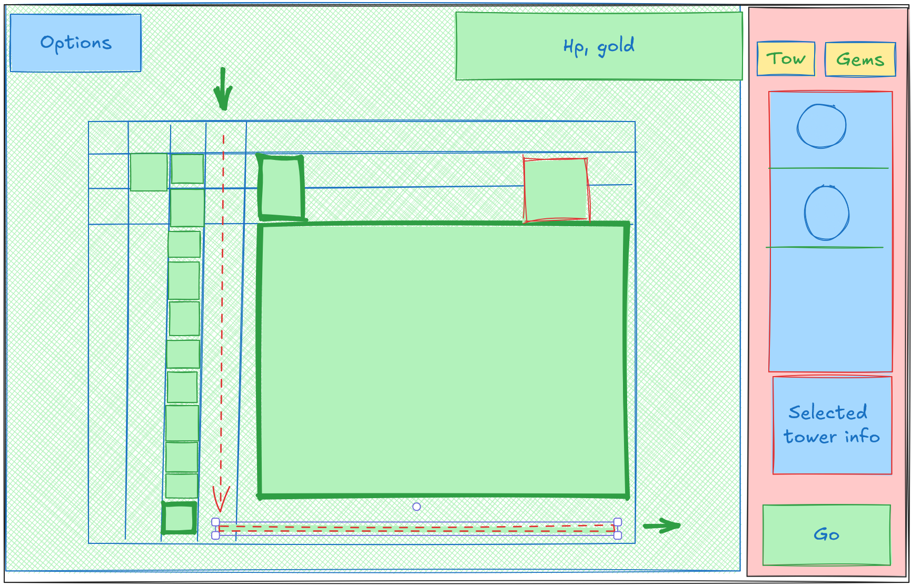

# Bastion

_The Watchers Lament_

# Game description and functionality

Bastion is a Tower Defense type of game.

The game offers the player various missions that he can play.
In each mission the player is tasked to defend a path going from the entrance of the map to exit of the map.
The player starts with 200g and 100 HP.
Each mission is split into multiple rounds. Each round consists of two phases:

1. Phase 1 (Buy phase) - The player can buy towers and place them on the map.
2. Phase 2 (Combat phase) - In this phase there the enemies spawn at the entrance of the map and start moving towards the exit. The towers will attack the enemies and try to stop them from reaching the exit. More enemies may spawn during the combat phase.

For every creep killed by the player, the player will receive Gold resource.
Every time a round is finished (Combat phase completes) the player will also receive one Gem.
The player can use the Gold to buy more towers or upgrade the existing ones.
If a creep reaches the exit, the player will lose a some health points (HP).
Players HP does not regenerate between rounds.
If the player loses all his HP, the game is over and the player has lost.
If the player completes all the rounds of a mission, the player wins and receives a Score which places him at a leaderboard.

# Functional description

## Game start

The game starts with a Main menu screen.

## Main menu screen

The main menu has the following options (buttons):

1. Play - Starts the game by going to the Mission selection screen
2. Options - For now disabled

## Mission selection screen

The mission selection screen has the following content:

1. List of missions where the player can choose one mission to play by going to the Mission screen
2. Back button - Goes back to the Main menu screen

## Mission screen

Mission screen is reached when the player selects a mission from the Mission selection screen.
The Mission screen has the following content:

- The map of the mission (image representation)
- The path of the creeps (line on the map)
- Amount of waves in the mission
- The entrance and exit of the map (marked on the map)
- Starting Gems - The amount of Gems the player starts with
- Button to start the mission (Game screen - Buy phase)
- Button to go back to the Mission selection screen

## Game screen

Every game screen (Buy or Combat phase) has the following content:
- Game map
- Options button - Opens the Options panel
- Sidebar - Content changes based on the phase
- Topbar - Shows the player's current HP, Gold, Score and Wave/Total Waves

Example:

### Game map

The map is covering the majority of the screen (80%). There is no zooming or panning. Depending on the map aspect ratio, the map may be cropped on the sides. The map is a grid where the player can place towers and through which the creeps will travel.
There are two types of ground on the map:
- Path - The path where the creeps will travel
- Buildable - The ground where the player can place towers
- Non-buildable - The ground where the player can not place towers

### Options Panel

The options panel is opened by pressed the options button located on the top left corner. The options panel allows the player to:

- Restart mission
- Return to main menu
- Close panel (opening it automatically pauses the game)

### Sidebar

The side bar is located on the right side of the screen spanning the full height of the screen and takes up a lesser amount of the screen (20%). It's functionality changes based on whether you are in the buy phase or combat phase.

### Topbar

The top bar is located to the left of the sidebar and shows you your current HP, Gold, Score and Wave/Total Waves.

## Game screen - Buy phase

During the buy phase (has no time limit), the player may spend their Gold to purchase towers and use their Gems to empower their towers in specific ways depending on the gems used.
Towers are built when the player drag/drops the tower icon from the sidebar onto the map grid.
When this happens the gold is deducted from the player's Gold resource.
Gems are 'slotted' by dragging them from the Gem bag to the tower. This will remove the gem from the Gem bag and empower the tower.
After the player has finished spending their resources/strategizing, they may end the Buy phase by pressing the "GO" button in the bottom right corner (sidebar).
It is possible to sell a tower by clicking on the tower, this will bring up a sell button which will refund the player a portion of the Gold spent on the tower (if the tower was bought in the current buy phase then the player will receive the full amount of Gold back).
Any sloted gems will be returned to the Gem bag.
It is possible to remove a gem from a tower by clicking on the tower, this will bring up a remove button which will remove the gem from the tower and return it to the Gem bag. This can be done at any time during the buy phase regardless when the Gem was slotted.
TODO: Gem leveling interface

### Sidebar - Buy phase

During the buy phase the sidebar is split into 2 tabs, the Tower menu and the Gem bag. The tower menu contains towers which you can place on the map grid.
You may purchase towers with Gold, and certain towers can be empowered with Gems while others can not. Towers themselves can not be upgraded instead you upgrade your Gems.
Gems are given at the start of the buy phase (specifically only 1 picked out of 3) and are subsequently placed into the gem bag.
From the Gem bag they can be slotted into a tower, upgraded or combined with other gems.
On the first tab (Towers menu) the list of available towers is shown as an icon in a vertical list.
On the second tab (Gem bag) the list of Gems is shown as an icon in a vertical list. Each Gem is represented by single icon (there can be many same type of Gems in the list).
Below the tower / gem icons there is a detailed description of currently selected tower / gem.
On the bottom of the sidebar there is a "GO" button which ends the buy phase and starts the combat phase.

_(razmisljam o tome da se gemovi na pocetku buy phasea moraju kupit i/ili mogu se rerollat i/ili da se "upgradeani" ili vec "craftani" gemovi isto mogu kupit)_
_(takodjer razmisljam da ima market tower koji se moze buildat)_

## Game screen - Combat phase
During this phase the player has no input (excep the Options menu) and the game is played 'automatically'.
At specific points in time the creeps will spawn at the entrance of the map and start moving towards the exit traversing the preset path.
If a tower has an ability to attack a creep it will do so automatically. Type of attack depends on the tower type and the Gems empowering it.
If a creep receieves enough damage it will die and the player will receive Gold. Any creep which reaches the exit will deal damage to the player's HP. Amount of damage depends on the creeps remaining HP.
Player may invoke the Options menu at any time during the combat phase. This will pause the game.
Combat phase will end when all creeps are dead / passed the exit or the player's HP reaches 0.

### Sidebar - Combat phase
In the combat phase the sidebar displays same information but it is disabled.

## Towers

Towers are the buildings you build on the map grid which attack/help you in defeating the creeps that are traversing the path.
Towers always target the the creep closest to the exit. Tower may switch targets if another creep is closer to the exit.
They always have a circular range around them within which they will attack creeps (if they have an attack).
Placing a tower on the grid costs a certain amount of Gold defined by the tower, while empowering it via Gem does not cost anything (Gems are not consumed, they are  "slotted" and can be later removed).
Towers on their own can not be upgraded, only the Gems that are empowering them can be.
Not all towers can be empowered (via Gems) and they would serve more for utility purposes instead of attacking creeps.

### Tower effects
There are several possible tower effects which describe the general behavior of the tower:

#### Shooter
This is standard effect available to each tower.
It enables the tower to attack the creeps by shooting projectile(s) at them.

#### Trap
The tower places a trap on the ground which will deal damage to the creeps that pass over it.
The trap is placed in the range of the tower randomly

#### Necromancer tower
This tower spawns creeps which will attack the other creeps. The spawned creeps will have a limited lifespan and will die after a certain amount of time. When this anti-creep meets another creep then one of them will 'die' instantly depending on the their health.

### Shooting Tower
Basic tower that shoots 1 projectile at the closest creep.

- Damage: 1
- Attack Cooldown: 2s
- Slot count: 3
- Cost: 100g
- Range: 2.5 Grid units
- Default effects: Shooter

### Circular Tower [WIP]

### Line tower [WIP]

### Chain tower [WIP]

### Damage types
We have several types of damage within the game:
- Physical (default damage type)
- Divine
- Fire
- Ice
- FrostFire

## Creeps

Creeps travel down the pre determined path of the map from the beginning to the end, which the towers will automatically target and which have a set amount of HP.
Upon reaching the end of the path, they will take away the amount of HP they have from the player's HP (if creep clears the path with 5 HP, player 100 -> 95 HP).
There are multiple types of creeps with varying amounts of HP, movement speed and special attributes (only vulnerable to divine attacks, etc).
Each creep follows the same 'line' through the cells which represent the path on the map.
Creeps may go through another creep if they are faster (they may overlap).
Creeps may have special attributes.

### Creep resistance and weaknesses
Creep may be resistant or weak to a specific type of damage.
For each creep there will be a percentage of damage reduction/increase for each damage type.

### Basic Creep

- Health: 2 HP
- Speed: 1 Grid unit per second
- Special attributes: None
- Damage resistance:
  - Physical: 0%
  - Divine: 0%
  - Fire: 0%
  - Ice: 0%
  - FrostFire: 0%

### Quick Creep [WIP]

### Bulky Creep [WIP]

### Undead Creep

Requires tower to be empowered with a divinity gem to deal damage, otherwise immune to damage.

- Health: 5 HP
- Speed: 40 pixels per second
- Special attributes: Undead, Weak to Divinity, Resistant to Soulforge
- Damage resistance:
  - Physical: 100%
  - Divine: -50%
  - Fire: 100%
  - Ice: 100%
  - FrostFire: 100%

## Creep waves 
Each round may have multiple waves of creeps. 
Each wave may have different types of creeps and different amounts of creeps.
A new wave may start at any time, even if the previous wave is not finished.
Every wave a creep is 'generated' at the map entrance. Once the creep has moved a bit then the next creep in the wave will be 'generated'.

## Resources

### Gold

Gold is the resource you get per every creep killed. Every creep decides how much Gold it gives upon its death. Gold is used to purchase towers and alter the map.
The player starts the game with 200 Gold and can not go below 0 Gold.

### Gems

Gems are not a number resource like Gold is, rather you earn one of the possible Gems upon completing a round. They are placed in your Gem bag which is accessible via the sidebar.
Gem has the following properties:
- Name
- Color (used for visual representation)
- Description
- Damage type (used for empowering towers)
- Game effects (used for empowering towers)
- Level

#### Possible gem effects
Games can only be sloted in towers. When slotted the gem may provide following effects for that tower:
- Increase damage
- Change the damage type
- Increase attack speed
- Increase range
- Increase number of targets (multi shot)
- Increase number of projectiles

#### Gem level
Gem level is a number from 1 to 5. Each level of a Gem enhances the effect of the Gem. The higher the level the more powerful the Gem is.
The actual effect of the level depends on the Gem type.

#### Gem types
Currently there are 6 Gems:

1. Fire Gem (#FF0000) (fire)
   - Description: A firey gem found inside the ancient ruins of a lost volcano dwelling civilization, this gem is infused with many eons of firey, quicky, volcanic energy to deliver fast and burning blows to all creeps.
2. Yeti Gem (#0000FF) (ice)
   - Description: [WIP]
3. Titalium Gem (#FFFFFF) (white)
   - Description: [WIP]
4. Soulforge Gem (#00FFFF) (cyan)
   - Description: [WIP]
5. Rift Gem (#FF00FF) (purple)
   - Description: [WIP]
6. Divinity Gem (#00FF00) (green)
   - Description: [WIP]

_(idealno 6 \* 4 combos)_  
_(impossible combos:_  
_soulforge + divinity_  
_rift + titalium_
_)_  
_fire + yeti gives frostfire_
_(kasnija ideja svakih 5 rundi dobit "utility" gem koji mozda ubrzava attack speed ili daje neke specificnije buffove)_  
_(ideja: merchanting gem, gemovi koji su kombinirani s ovim gemom kostaju 10% manje, round down)_  
_(ideja: scavenger gem, gemovi koji su kombinirani s ovim gemom 25% vise golda nego sto creep normalno daje, round up)_

### HP

HP (Health Points) is the resource that you always start with 100 of and you must keep it >0 upon finishing the final round to win the mission.
The player starts the game with 100 HP and loses the game when it reaches 0 HP.

### Score

At the end of the game (player has survived all rounds) the player receives a score which is based on the amount of Gold the player has left, the amount of HP the player has left and the amount of creeps killed.
If the player loses the game, the score is always 0.

# Data structures and algorithms

## Mission definition
- Name
- Description
- Map image
- Game map definition
- Array of rounds
- Array of Gem definitions (random type given to player at mission start)

### Game map definition
- Grid size (width, height)
- 2d array of terrain types (Path, Buildable, Non-buildable)
- Array of paths (array of rows and column which represent the path, first cell is the entrance, last cell is the exit)

### Mission round definition
- Array of waves
- Array of Gem types (which the player can get at the end of the round - only 1 picked out of 3)

### Wave definition
- Tick when first creep is generated (calculated once all creeps of the previous wave are generated)
- Ticks between creeps
- Array of creep definitions (identified by creep definition name) together with number of creeps per type

## Mission instance
- Mission definition
- Current round index
- Array of waves
- Current HP
- Current Gold
- Current Score
- Array of Gems
- Current game map instance
- Current tick

## Game map instance
- Game map definition
- Array of tower instances
- Array of creep instances
- Array of fired bullets

## Wave instance
- Wave definition
- Array of creeps left to be generated (once the array is empty the wave is finished)

## Tower definition 
- Name 
- Cost (Gold amount)
- Gem slot count (0 if not empowerable)
- Image (sprite)
- Description
- Base damage amount (damage dealt to creeps)
- Attack Cooldown (time between attacks)
- Attack range (in Grid units)
- Array of initial tower effects (enumeration)
- Array of allowed Gem types (enumeration)

## Tower instance 
- Tower definition
- Grid row and column (position on the map)
- Gems (array of Gems)
- Round in which it was built (used for selling)
- Ticks from last attack (used for attack cooldown)
- Current damage amount
- Current damage type (depends on Gems)
- Array of tower effects (enumeration)

## Trap instance
- Position (x, y in Grid units)
- Damage type
- Damage amount
- Tick created
- Tick duration (lifespan)
- Image (sprite)

## Bullet instance
- Current position (x, y in Grid units)
- Target position (x, y in Grid units)
- Damage type
- Damage amount
- Image (sprite)

## Creep definition
- Name
- Maximum HP
- Speed
- Image (sprite)
- Damage resistance (percentage for each damage type)
- Special attributes (hardcoded attribute types)

## Creep instance
- Creep definition
- Current position (x, y in Grid units)
- Current HP (also represents damage dealt to player if reaches exit and damage dealt to other creeps if it is an anti-creep)
- Current speed
- Is anti-creep (if true then it will attack other creeps)
- Anti-creep damage type (if anti-creep)

# Future work
- Add leaderboard functionality to [Mission screen]
- Ability to restart at the current round of the mission [Options panel]
- When in combat phase the 'Go' button should be replaced with 'Speed up' toggle button [Sidebar - Combat phase]
- Add tower selling functionality [Game screen - Combat phase]
- Add Gem combining functionality [Sidebar - Buy phase]